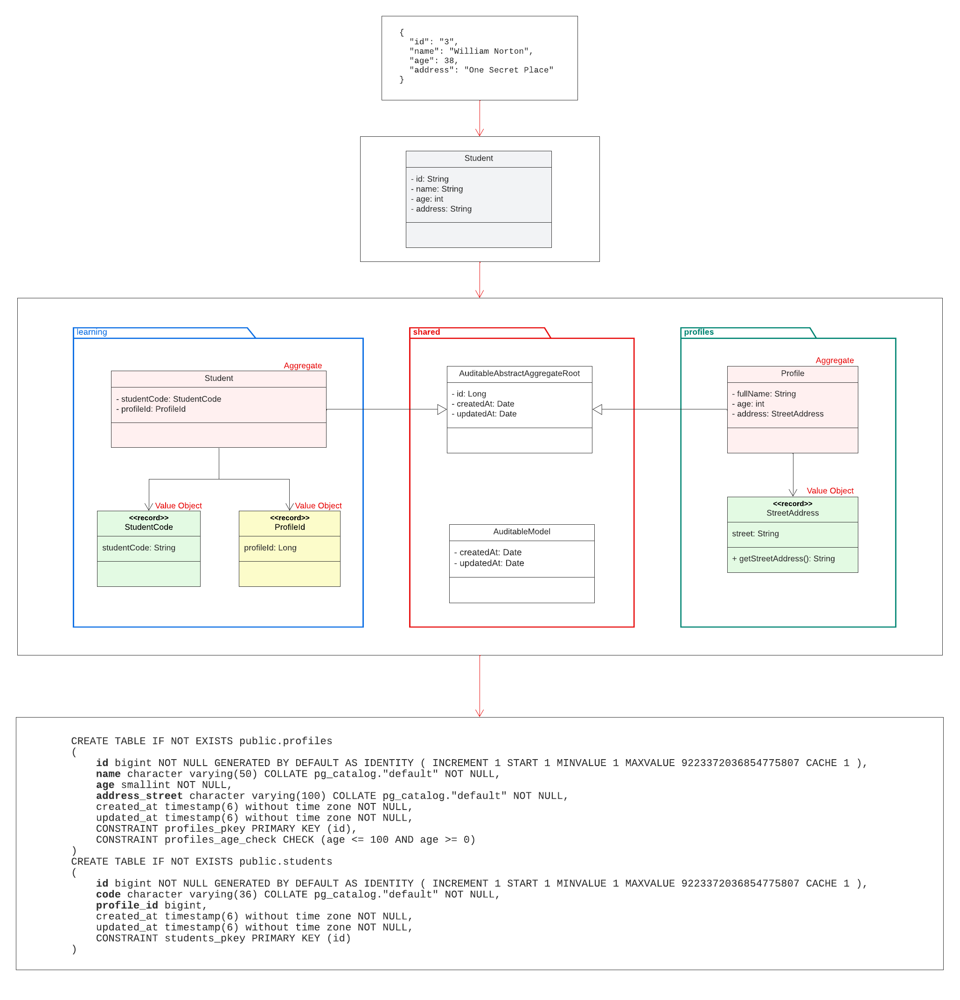
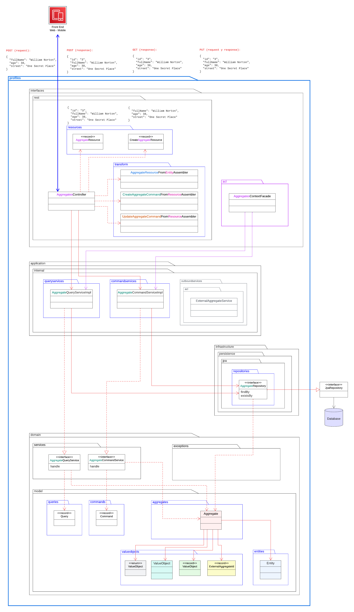
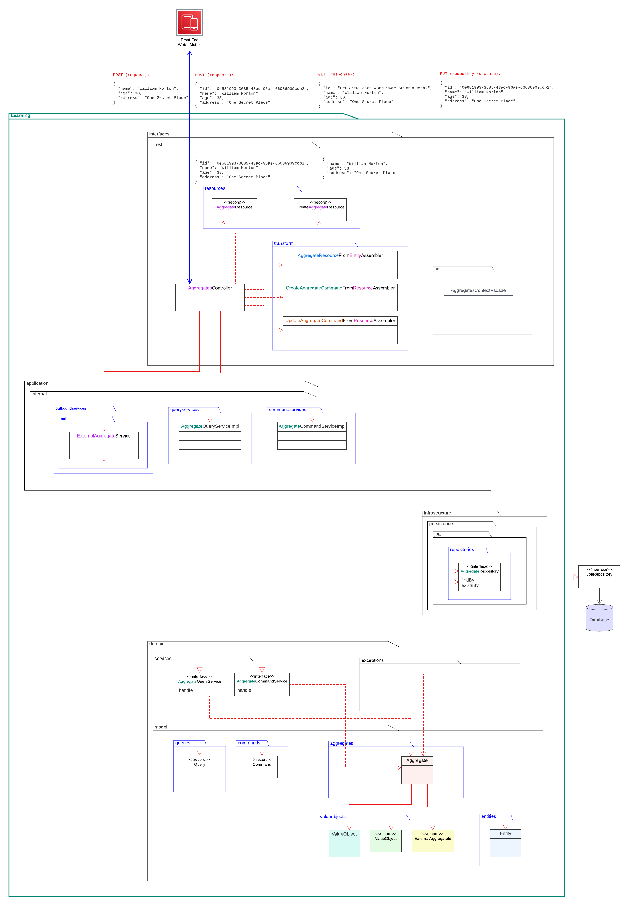
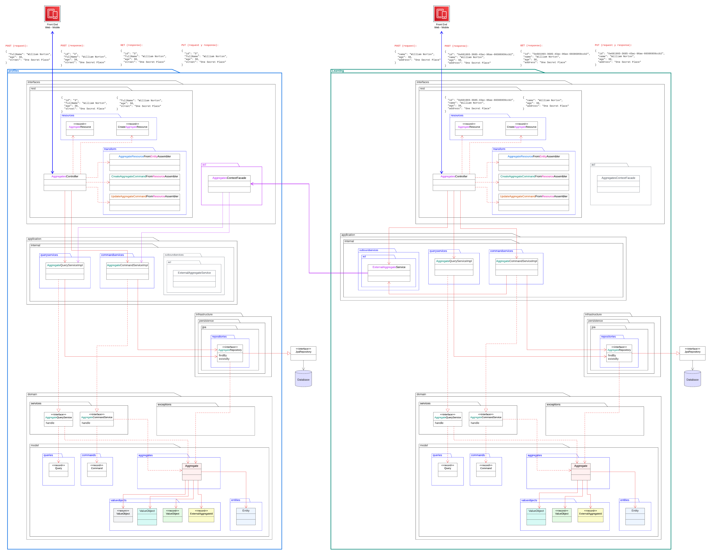

# Learning Center Platform Mini - Documentation

## Table of contents

## Documentación

A continuación se puede observar el análisis del json de respuesta y la generación del diagrama de clases y DDL del SQL de la Base de datos:

A continuación se observa la estructura de **Profiles Bounded Context**:

A continuación se observa la estructura de **Learning Bounded Context**:

A continuación se observa la estructura completa entre Profiles Bounded Context y Learning Bounded Context mediante un ACL

